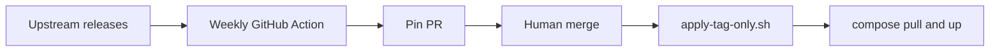
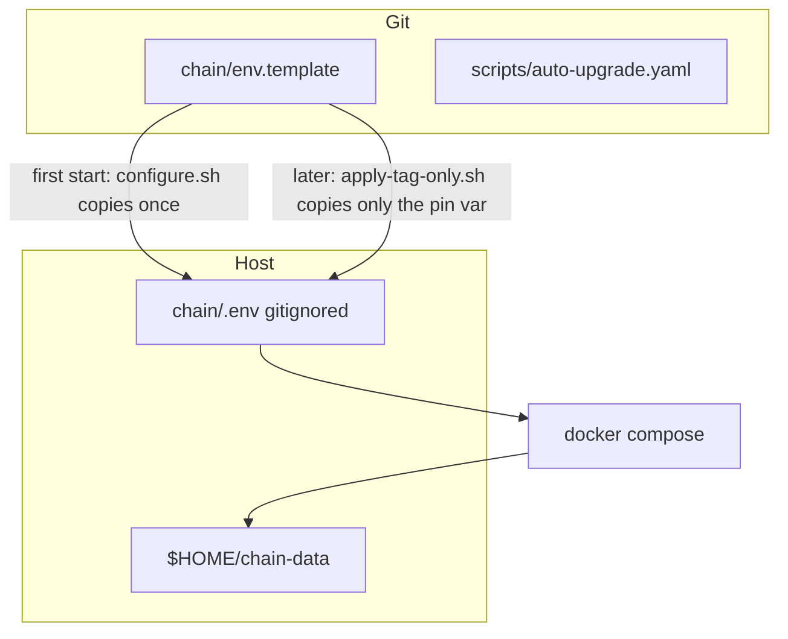
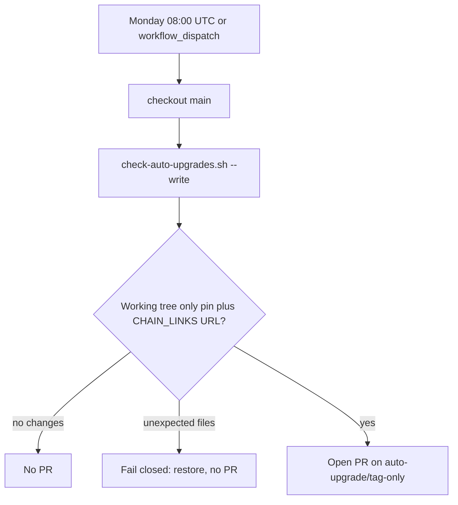
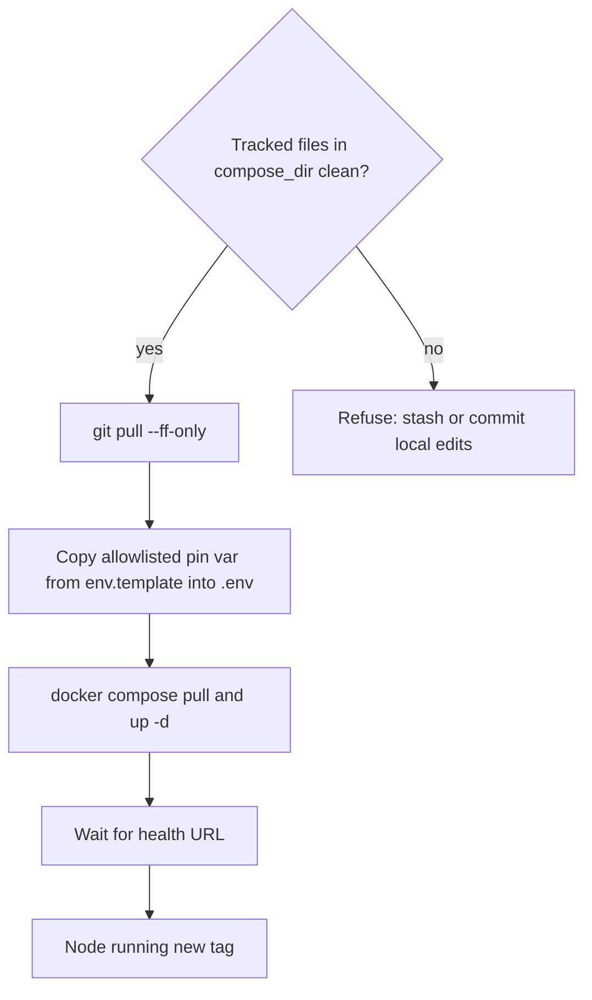
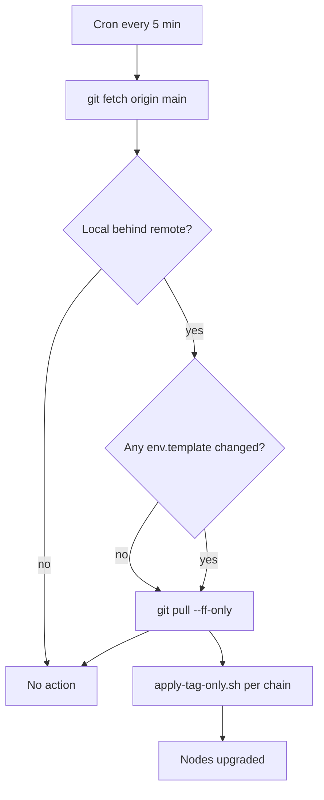

# Tag-only auto-upgrades

Architecture for bumping client **image tags** when nothing else has to change: no compose flags, genesis, JWT, or datadir work.

Lookup rules for *where* to find upstream versions stay in [CLIENT_UPDATES.md](CLIENT_UPDATES.md). This file is *how* the automated path works.

## Current status (v1)

| Chain | Git pin | Upgrade class | Allowlist (`auto-upgrade.yaml`) | Host apply |
| --- | --- | --- | --- | --- |
| Aptos | `aptos-node-v1.48.7-hotfix` | tag-only | **yes** — same-series `v1.48.*` | `./scripts/apply-tag-only.sh aptos` |
| Arbitrum | `nitro-node:v3.11.3-beb2108` | tag-only | **yes** — same-series `v3.11.*` (docker tag from the GitHub release body, not the bare git tag) | `./scripts/apply-tag-only.sh arbitrum` |
| Berachain | `bera-reth:v1.4.4` | tag-only | **yes** — same-series `v1.4.*`. beacon-kit stays `needs-review` | `./scripts/apply-tag-only.sh berachain` |
| Bob | OP Labs `op-reth` + `op-node` | tag-only | **yes** — same-series Superchain tags (`apply_group: bob`) | `./scripts/apply-tag-only.sh bob` |
| Core | `GETH_VERSION=v1.0.26` | tag-only | **yes** — same-series `v1.0.*`; host apply **builds** the local image | `./scripts/apply-tag-only.sh core` |
| Gnosis Chain | `reth_gnosis` + `lighthouse` | tag-only | **yes** — same-series (`apply_group: gnosis`) | `./scripts/apply-tag-only.sh gnosis` |
| Katana | `conduit-op-reth` + OP Labs `op-node` | tag-only | **yes** — same-series (`apply_group: katana`) | `./scripts/apply-tag-only.sh katana` |
| Lisk | OP Labs `op-reth` + `op-node` | tag-only | **yes** — same-series Superchain tags (`apply_group: lisk`) | `./scripts/apply-tag-only.sh lisk` |
| Mode | OP Labs `op-reth` + `op-node` | tag-only | **yes** — same-series Superchain tags (`apply_group: mode`) | `./scripts/apply-tag-only.sh mode` |
| Neo X | `GETH_VERSION=v0.6.2` | tag-only | **yes** — same-series `v0.6.*`; host apply **builds** the local image | `./scripts/apply-tag-only.sh neox` |
| Optimism | OP Labs `op-reth` + `op-node` | tag-only | **yes** — same-series Superchain tags (`apply_group: optimism`) | `./scripts/apply-tag-only.sh optimism` |
| Plume | `nitro-node:v3.9.5-*-validator` | tag-only | **yes** — same-series `v3.9.*-validator` (release body) | `./scripts/apply-tag-only.sh plume` |
| Robinhood | `nitro-node:v3.11.3-beb2108` | tag-only | **yes** — same-series `v3.11.*` (release body, like Arbitrum) | `./scripts/apply-tag-only.sh robinhood` |
| Ronin | `conduit-op-reth` + OP Labs `op-node` | tag-only | **yes** — same-series (`apply_group: ronin`). EigenDA stays `needs-review` | `./scripts/apply-tag-only.sh ronin` |
| Sei | `SEID_VERSION=v6.6.3` | tag-only | **yes** — same-series `v6.6.*` | `./scripts/apply-tag-only.sh sei` |
| Tempo | `tempo:1.14.0` | tag-only | **yes** — same-series `1.14.*` (git tag `v*` → GHCR tag without `v`) | `./scripts/apply-tag-only.sh tempo` |
| Worldchain | OP Labs `op-reth` + `op-node` | tag-only | **yes** — stock Superchain series (`apply_group: worldchain`) | `./scripts/apply-tag-only.sh worldchain` |
| Zircuit | `conduit-op-reth` + OP Labs `op-node` | tag-only | **yes** — same-series (`apply_group: zircuit`) | `./scripts/apply-tag-only.sh zircuit` |
| Abstract | stays `needs-review` | never auto across EN majors (`v29`→`v31` needs snapshot wipe) | no | `<chain>/README.md` |
| Linea feecap / other config | not a client pin | out of this workflow | no | — |

A new agent picking up “upgrade X”: read this file + CLIENT_UPDATES, run the notes check, **wait for the user to pick** before bumping `needs-review` / needs-config. `apply-tag-only.sh` only works for YAML ids.

## Two layers

Pins live in git (`env.template`). Running nodes read `.env` on the host. Automation has to move a new tag through **both**.



| Layer | What it does | What it does not do |
| --- | --- | --- |
| **Git** | Detect a newer same-series tag, write the pin, open a PR | Merge, restart nodes, rewrite compose |
| **Host** | After merge: copy that pin into existing `.env`, pull the image, recreate the container | Bump git, change secrets or L1 URLs |

v1 does **not** auto-merge. Merge (and host apply) should follow a [release-notes check](#agent-release-notes-check) that the bump is still pin-only.

## What “tag-only” means

A bump is tag-only when all of these hold:

- The only repo edits are the pin in `env.template` (and the matching version URL in [CHAIN_LINKS.md](CHAIN_LINKS.md) if it names that tag).
- Compose flags, genesis/waypoint, JWT, and datadir layout stay the same.
- The new tag is still on the **currently pinned major.minor series**.

**Who decides that compose/genesis would not change for a given tag?**

- **Series allowlist** ([`scripts/auto-upgrade.yaml`](scripts/auto-upgrade.yaml)) — a human, once: “patches on this major.minor are *usually* image-only.” CI uses only this plus same-series + fail-closed. It never reads notes.
- **Per bump** — a **manual agent check** (check-client-updates skill): fetch release notes / git compare from the pinned tag to latest, and infer **pin-only** vs **needs-config**. That is what answers “would anything besides the pin change?” for *this* release. Ambiguous notes → needs-config.

Weekly CI can still open a pin PR for allowlisted series. Merge (or a host apply) should wait until that notes check says pin-only — or a human has read the notes themselves.

What *is* automated vs inferred:

| Check | Who | What it actually proves |
| --- | --- | --- |
| Allowlist row in [`scripts/auto-upgrade.yaml`](scripts/auto-upgrade.yaml) | Human (once per chain/series) | “Patch tags on this series are *expected* to be image-only.” |
| Same major.minor as the current pin | [`scripts/check-auto-upgrades.sh`](scripts/check-auto-upgrades.sh) | Not a series jump (`1.48`→`1.49` never auto). |
| Fail closed after `--write` | Same script | **Our write** only touched the pin line + CHAIN_LINKS URL. It does not inspect upstream. |
| Release notes pin → latest | Agent (manual check-client-updates) | **This** bump is pin-only or needs-config, with quoted evidence. |
| Merge the PR | Human | Confirms the agent (or their own reading). If needs-config, close the auto-PR and pause the YAML row. |

```mermaid
flowchart TD
  newTag[New upstream tag]
  listed{Chain in auto-upgrade.yaml?}
  series{Same major.minor as the current pin?}
  write[Script writes pin plus CHAIN_LINKS URL]
  closed{git diff only those allowed paths?}
  pr[Open PR]
  agent[Manual agent: read release notes pin to latest]
  class{Inferred class?}
  auto[Host apply]
  review[needs-review playbook]
  abort[Fail closed: restore, no PR]
  pause[Close PR; pause or drop YAML row]

  newTag --> listed
  listed -->|no| review
  listed -->|yes| series
  series -->|no: 1.48 to 1.49, v29 to v31, Nitro 3.7 to 3.11| review
  series -->|yes| write --> closed
  closed -->|unexpected files| abort
  closed -->|yes| pr --> agent
  agent --> class
  class -->|pin-only| auto
  class -->|needs-config or ambiguous| pause
```

Examples:

- Aptos `aptos-node-v1.48.5-hotfix` → `v1.48.7-hotfix` — tag-only (allowlisted).
- Aptos `v1.48` → `v1.49` — human bump onto the new series first; then auto can follow `v1.49.*`.
- Abstract `v29` → `v31` — never auto (snapshot wipe).
- Arbitrum Nitro `3.7` → `3.11` — done as needs-review (one-way DB). Pin is `v3.11.3`; allowlisted for **`v3.11.*` patches only**. A `v3.12` git tag is ignored until a human bumps the pin onto that series.

## Agent release-notes check

The weekly script only compares tags. A **manual** check-client-updates run is what reads notes.

For each pin that is behind latest:

1. Open the GitHub compare (or the chain’s upgrade doc / official compose) from **pinned tag → latest**.
2. Classify **pin-only** (image/binary only) vs **needs-config** (flags, genesis, snapshot wipe, migrations, paired bumps, “operator action required”).
3. If notes are missing or unclear → **needs-config**. Quote the bullets that decided it.

Allowlisted + pin-only: merge the auto-PR (or bump the pin) and hosts can `apply-tag-only.sh`. Allowlisted + needs-config: close or skip that PR; do not host-apply; pause the YAML row until a human upgrade lands.

This does not run in GitHub Actions v1. Trigger it in Cursor (“check client updates” / “check Aptos notes for the open pin PR”).

### What “inferred class” actually is

A label the agent assigns **this bump** (pinned tag → latest), with quoted evidence. It is not a git write and not the YAML allowlist.

**Inputs** (Aptos example: pin `aptos-node-v1.48.7-hotfix`, latest `aptos-node-v1.48.8-hotfix`):

- GitHub compare: `https://github.com/aptos-labs/aptos-core/compare/aptos-node-v1.48.7-hotfix...aptos-node-v1.48.8-hotfix`
- Release body for each tag in between (changelog bullets)
- Official upgrade/compose docs if that is the [CLIENT_UPDATES.md](CLIENT_UPDATES.md) source (not Aptos’s usual case)

**Output** — one of:

| Class | Means | Typical evidence | Then what (if the chain is allowlisted) |
| --- | --- | --- | --- |
| **pin-only** | Operators can swap the image/tag and restart. No new flags, genesis/waypoint, JWT, snapshot wipe, DB migration, or paired-client bump. | “Bugfix / hotfix”; Docker image bump; no “breaking”, “migration”, “re-bootstrap”, “new flag”. | Human merges the pin PR; hosts run `apply-tag-only.sh`. |
| **needs-config** | This repo or the live node needs more than `APTOS_IMAGE=…`. | New/removed CLI flags, genesis/waypoint refresh, snapshot recovery, schema/Flyway, “operator action required”, op-reth+op-node together. | Do **not** merge the auto-PR; do **not** host-apply; pause or drop the YAML row until a human upgrade lands. |
| **ambiguous** | Notes missing, empty, or unclear. | Compare 404, “see commit list”, no operator section. | Same as **needs-config** — never guess pin-only. |

The diagram’s `Inferred class?` block is that table: **pin-only** vs **needs-config or ambiguous**. CI has already opened (or would open) a pin-only-looking PR; this step decides whether that PR is actually safe.

The agent still does not merge or restart nodes. You confirm, then merge / apply or close.

## Why `.env` is a separate step

`configure.sh` copies `env.template` → `.env` **only if `.env` is missing**. Live hosts keep passwords, L1 URLs, and the old image pin after `git pull`.



`apply-tag-only.sh` never re-runs `configure.sh` and never rewrites other `.env` keys.

### Needs-review host apply (no YAML row)

`apply-tag-only.sh` will refuse unknown chain ids. After a human pin bump is merged:

1. Notes check already said needs-config (or needs-review + user picked). Follow `<chain>/README.md`.
2. On the host: `git pull --ff-only`. Copy **only** the pin var from `env.template` into existing `.env` (do not `cp env.template .env` — that wipes L1 URLs). Chains without `configure.sh` are the same: edit one line.
3. If notes said one-way DB / cannot downgrade: stop the client and cold-copy the datadir first.
4. `docker compose pull && docker compose up -d` in the chain directory.

## Allowlist

Machine-readable source of truth: [`scripts/auto-upgrade.yaml`](scripts/auto-upgrade.yaml). Do not parse the markdown tables.

[`CLIENT_UPDATES.md`](CLIENT_UPDATES.md) **Upgrade class** must stay in sync:

- `tag-only` — also a YAML row; CI may open a pin PR. Host apply after a [notes check](#agent-release-notes-check) says pin-only.
- `needs-review` — agent playbook only; do not bump until a human picks.

Adding a chain is one YAML object (id, pin file/var, image prefix, GitHub repo, tag prefix, compose dir, optional health URL, optional `image_tag_from: release_body` when the docker tag is not the git tag, optional `strip_git_prefix` when git tags include a component prefix, optional `apply_group` when two pins share a compose dir). Auto only follows tags that share major.minor with **whatever is currently pinned**.

v1 allowlist: **Aptos**, **Arbitrum**, **Robinhood**, Superchain OP Stack (**Bob**, **Lisk**, **Mode**, **Optimism**, **Worldchain**), Conduit (**Katana**, **Plume**, **Ronin**, **Zircuit**), plus **Berachain** (bera-reth only), **Core**, **Gnosis Chain** (reth_gnosis + lighthouse), **Neo X**, **Sei**, and **Tempo**. OP Stack rows are one pin each (`*-op-reth` / `*-op-node`) with a shared `apply_group` so hosts run `./scripts/apply-tag-only.sh katana` once. OP Labs git tags are `op-reth/v*` / `op-node/v*`; `strip_git_prefix` maps those to docker tags `v*`. Tempo strips the git `v` (`v1.14.0` → GHCR `1.14.0`). Conduit execution uses `conduitxyz/conduit-op-reth` tags `v*`. Plume is Nitro `image_tag_from: release_body` with `image_tag_suffix: -validator`. Core and Neo X set `compose_build: true` (version-only `GETH_VERSION`; apply rebuilds the local image). Auto only follows tags that share major.minor with **whatever is currently pinned**.

## Git layer (detect + PR)



Pieces:

- [`scripts/check-auto-upgrades.sh`](scripts/check-auto-upgrades.sh) — reads each YAML row, lists GitHub tags, keeps same-series stable tags (drops `-rc`, `-alpha`, …), writes the pin if upstream is newer. When `image_tag_from: release_body` (Arbitrum), the pin is the docker tag named in that git tag’s release body.
- [`.github/workflows/auto-upgrade.yml`](.github/workflows/auto-upgrade.yml) — weekly + manual; **no auto-merge**. Before merge, run the [agent notes check](#agent-release-notes-check) (or read the notes yourself).
- Fail closed: if `--write` touches anything other than the pin line and the CHAIN_LINKS version URL, it restores and exits.

### What `--write` actually edits

For Aptos today, the YAML says `var: APTOS_IMAGE`, `image_prefix: aptoslabs/validator:`, `chain_links: true`. Suppose the pin is `aptos-node-v1.48.7-hotfix` and same-series latest is `aptos-node-v1.48.8-hotfix`.

**1. The pin** — one assignment in [`aptos/env.template`](aptos/env.template):

```
APTOS_IMAGE=aptoslabs/validator:aptos-node-v1.48.7-hotfix
```

becomes

```
APTOS_IMAGE=aptoslabs/validator:aptos-node-v1.48.8-hotfix
```

Comments, ports, and every other key are left alone. Compose is not touched. `.env` on hosts is not touched (that is `apply-tag-only.sh` after merge).

**2. The docs link** — only if `chain_links: true` and the old git tag already appears in [`CHAIN_LINKS.md`](CHAIN_LINKS.md). Aptos currently has:

```
[Node release v1.48.7-hotfix](https://github.com/aptos-labs/aptos-core/releases/tag/aptos-node-v1.48.7-hotfix)
```

`--write` does two `replace`s on that file:

| Find | Replace with |
| --- | --- |
| `aptos-node-v1.48.7-hotfix` (full git tag) | `aptos-node-v1.48.8-hotfix` |
| `v1.48.7-hotfix` (label after stripping `tag_prefix` `aptos-node-v`, then adding a leading `v`) | `v1.48.8-hotfix` |

Result:

```
[Node release v1.48.8-hotfix](https://github.com/aptos-labs/aptos-core/releases/tag/aptos-node-v1.48.8-hotfix)
```

If the old tag is not in `CHAIN_LINKS.md`, that file is skipped. No other rows or URLs are *intended* to change; fail-closed aborts if any file besides that chain’s `env.template` and `CHAIN_LINKS.md` became dirty, or if `env.template` changed more than the allowlisted pin line(s) for that file (one var, or both `OP_RETH_IMAGE` / `OP_NODE_IMAGE` on a Conduit OP Stack chain).

Arbitrum is the same pin-line write, with `chain_links: false`. GitHub’s latest same-series tag might be `v3.11.4`; the pin written is `offchainlabs/nitro-node:v3.11.4-<hash>` from that release body (not `nitro-node:v3.11.4`).

Local check without writing:

```bash
./scripts/check-auto-upgrades.sh
```

### GitHub Actions and pull requests

The workflow uses the default `GITHUB_TOKEN`. That token can push the `auto-upgrade/tag-only` branch, but **it cannot open a pull request** unless the repo allows it.

If the job is green (or only warns) and **no PR appears**:

**Settings → Actions → General → Workflow permissions → “Allow GitHub Actions to create and approve pull requests”**

That checkbox does **not** auto-merge and does not replace review. It only lets the Actions bot *create* the PR. Merge stays a human click.

If you leave it off, run `./scripts/check-auto-upgrades.sh --write` locally and open the PR yourself.

## Host layer (apply)

After the PR is merged, a host with a clean `<chain>/` checkout:

```bash
./scripts/apply-tag-only.sh aptos
./scripts/apply-tag-only.sh arbitrum
./scripts/apply-tag-only.sh katana
```



- Requires an existing `.env` (first start is still `./configure.sh` or `cp env.template .env`).
- Syncs **only** the YAML pin var (e.g. `APTOS_IMAGE`, `NITRO_IMAGE`).
- Aptos health: GET `http://127.0.0.1:${HTTP_PORT}/v1`. Nitro (Arbitrum, Plume, Robinhood), Gnosis `reth_gnosis`, Sei, Tempo, and OP Stack op-reth pins use `health_mode: block_time` (`eth_getBlockByNumber`, latest block ≤10s old); chains without YAML health config skip the check after compose up.
- OP Stack: pass the **apply group** (`katana`, `zircuit`, `ronin`, `bob`, `mode`, `lisk`, `optimism`, `worldchain`) to sync both execution and op-node pins in one compose up. Pin ids (`katana-op-reth`) still work for a single var.
- Core / Neo X: `compose_build: true` — apply runs `docker compose up -d --build` (the binary is baked from `GETH_VERSION`, not pulled).
- Optional: `SKIP_PULL=1`, `SKIP_COMPOSE=1`, `HEALTH_TIMEOUT=180`.

Chain-specific apply notes stay in `<chain>/README.md` (see [aptos/README.md](aptos/README.md)).

### Automatic host apply (pull-based)

[`scripts/auto-apply-if-merged.sh`](scripts/auto-apply-if-merged.sh) automates the host layer: it fetches `origin/main`, detects which allowlisted chains have merged `env.template` bumps, pulls, and runs `apply-tag-only.sh` for each.



**Setup on each host:**

1. Clone or ensure the repo checkout exists (e.g. `/opt/blockchain-rpc-nodes`).
2. First-start each chain normally (`./configure.sh`, `docker compose up -d`).
3. Add a cron job (as the user that owns the checkout and can run Docker):

```bash
# Run every 5 minutes
crontab -e
```

```
*/5 * * * * /opt/blockchain-rpc-nodes/scripts/auto-apply-if-merged.sh >> /var/log/auto-upgrade.log 2>&1
```

**Options:**

| Variable | Default | Effect |
| --- | --- | --- |
| `REPO_DIR` | Script's parent | Path to the repo checkout |
| `REMOTE` | `origin` | Git remote to fetch |
| `BRANCH` | `main` | Branch to track |
| `DRY_RUN=1` | off | Print what would be applied without running |
| `SKIP_FETCH=1` | off | Skip fetch (use existing local vs remote refs) |

**Filter specific chains:**

```bash
# Apply only aptos and katana if they changed
./scripts/auto-apply-if-merged.sh aptos katana
```

**Logging:**

The script is idempotent and logs each run. Typical output:

```
Already up to date (a1b2c3d4).
```

Or when upgrades are applied:

```
Pulling origin/main (a1b2c3d4 → e5f6g7h8)...
Applying tag-only upgrades for: aptos katana

=== aptos ===
aptos: APTOS_IMAGE
  was: aptoslabs/validator:aptos-node-v1.48.7-hotfix
  now: aptoslabs/validator:aptos-node-v1.48.8-hotfix
Waiting for http://127.0.0.1:8080/v1 (timeout 180s)
Healthy: http://127.0.0.1:8080/v1

=== katana ===
...

Done. Applied 2 upgrade(s).
```

**Requirements:**

- Git, Python 3, Docker, curl on the host
- The checkout must be on `main` (or whatever `BRANCH` is set to)
- No uncommitted changes in chain directories (same as manual `apply-tag-only.sh`)

## Non-goals (v1)

- No Abstract EN major jumps, no Arbitrum series jumps, no config-only changes (e.g. Linea feecap)
- No rewriting per-chain `configure.sh` to merge all template keys
- The check-client-updates agent skill still handles `needs-review` chains

Conduit OP Stack, Superchain replicas, Nitro (Arbitrum/Robinhood/Plume), Tempo, Sei, Core, Neo X, and Berachain bera-reth same-series patches are allowlisted. Beacon-kit and Ronin EigenDA stay `needs-review`. Then consider auto-merge for `tag-only` PRs only.
