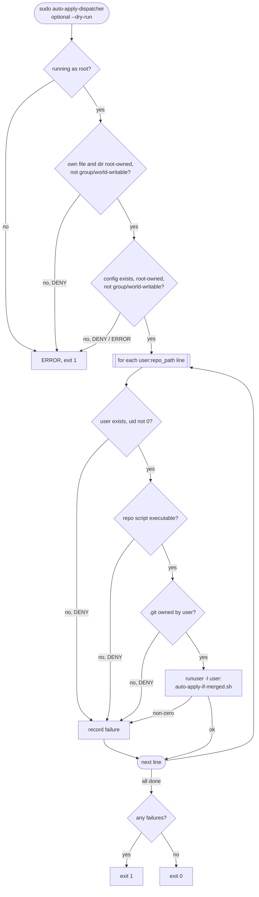

# Auto-apply on merge — flow

Decision flow of [`scripts/auto-apply-if-merged.sh`](../scripts/auto-apply-if-merged.sh) and [`scripts/auto-apply-dispatcher.sh`](../scripts/auto-apply-dispatcher.sh). Setup, rules and commands: [AUTO_UPGRADES.md — Apply on merge (cron)](../AUTO_UPGRADES.md#apply-on-merge-cron).

Every refusal is logged as `DENY <subject>: <reason>` on stderr and in syslog (`journalctl -t auto-apply`, `journalctl -t auto-apply-dispatcher`).

## auto-apply-if-merged.sh

One run, as the user that owns the checkout.

```mermaid
flowchart TD
  start(["cron every 5 min or by hand<br/>optional --dry-run"]) --> deps{"git, python3, docker, flock on PATH?"}
  deps -->|no| err1["ERROR, exit 1"]
  deps -->|yes| lock{"take .git/auto-apply/lock"}
  lock -->|held| quit0["another run, exit 0"]
  lock -->|ok| dockerok{"docker daemon reachable?"}
  dockerok -->|no| err1

  subgraph update ["Update checkout"]
    branch{"on branch main?"}
    fetch["git fetch"]
    same{"HEAD equals origin/main?"}
    anc{"HEAD ancestor of origin/main?"}
    guard{"any changed file other than *.md,<br/>dir/env.template, or files in chain dirs<br/>without .env here?"}
    blocked["DENY merge per file, BLOCKED<br/>compare against HEAD"]
    drymerge{"--dry-run?"}
    ff["git merge --ff-only"]
    branch -->|yes| fetch --> same
    same -->|no| anc
    anc -->|yes| guard
    guard -->|no| drymerge
    guard -->|yes| blocked
    drymerge -->|no| ff
  end

  dockerok -->|yes| branch
  branch -->|"no, DENY"| err1
  anc -->|"no, DENY"| err1
  same -->|yes| loop
  drymerge -->|"yes, compare against origin/main"| loop
  ff --> loop
  blocked --> loop

  loop[["for each apply target<br/>filtered by CLI args"]]

  subgraph check ["check_target (read-only)"]
    envx{"compose_dir/.env exists?"}
    diff{"any pin var: env.template differs from .env?"}
    unset{"pin var set in .env?"}
    hist{".env value ever a repo pin?"}
    valid{"new pin valid?<br/>image_prefix, series, exclude, plain tag"}
    hold{"AUTO_APPLY_HOLD=1?"}
    marker{"failed marker exists?"}
    running{"containers running from this compose dir?"}
    envx -->|yes| diff
    diff -->|yes| unset
    unset -->|yes| hist
    hist -->|yes| valid
    valid -->|yes| hold
    hold -->|no| marker
    marker -->|no| running
  end

  loop --> envx
  envx -->|no| next
  diff -->|"no (--dry-run logs up to date)"| next
  unset -->|"no, DENY, exit 1"| next
  hist -->|"no, DENY manual override"| next
  valid -->|"no, DENY, exit 1"| next
  hold -->|"yes, DENY hold"| next
  marker -->|"yes, reported at end"| next
  running -->|"no, apply once it runs"| next

  running -->|yes| dryapply{"--dry-run?"}
  dryapply -->|"yes, would apply"| next

  subgraph apply ["apply-tag-only.sh with SKIP_PULL=1"]
    clean{"compose_dir tracked files clean?"}
    owner{"compose project only from this dir?"}
    sync["copy pin vars env.template to .env"]
    up["docker compose pull and up -d"]
    health{"health check ok?"}
    clean -->|yes| owner
    owner -->|yes| sync --> up --> health
  end

  dryapply -->|no| clean
  clean -->|no| fail
  owner -->|"no, exit 3, .env untouched"| fail
  health -->|no| fail
  health -->|yes| ok["done, applied++"]
  fail["write .git/auto-apply/failed/target<br/>DENY, failed++"]

  ok --> next
  fail --> next
  next(["next target"]) --> loop
  next -->|all done| report["log applied count<br/>DENY for every failed marker"]
  report --> exitq{"failures, markers, security denies<br/>or BLOCKED?"}
  exitq -->|yes| err1b["exit 1"]
  exitq -->|no| exit0["exit 0"]
```

### Retry after a failed apply

| Failed at | `.env` | After the marker is removed |
| --- | --- | --- |
| Dirty compose dir, project collision (exit 3) | unchanged, still pending | next run retries |
| Compose or health check | already has the new pin | no retry; fix the node by hand |

## auto-apply-dispatcher.sh

Root cron or by hand, from a root-owned installed copy.

